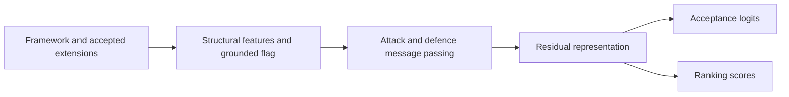

# ExplainableArgGCN: Inspectable Graph Learning for Argumentation

[](https://github.com/lmlearning/ExplainableArgGCN/actions/workflows/tests.yml)

**Explore how attack and defence relationships influence graph-based argument acceptance.** This research implementation combines structural features, paired message passing, residual connections and a ranking objective, with baseline models, ablations and influence visualizations.

## Run a real CPU smoke example

Use Python 3.11 in an activated virtual environment on Linux or Windows, from the repository root:

```bash
python -m pip install -r requirements-cpu.txt pytest
python -m examples.cpu_demo
python -m pytest -q tests
```

The example creates a three-argument framework and known extension, loads it through the actual dataset loader, then runs the refined model's forward and backward passes. It reports targets `[1, 0, 1]`, two `[3]` output shapes and finite loss/gradients. It requires no checkpoint or training-data download and reports no benchmark accuracy.

Alternatively, `python scripts/setup_cpu.py` creates `.venv` and installs the pinned CPU requirements. It never deletes data/cache files, runs system package managers or rewrites requirements. `setup_environment.sh` delegates to the same installer.

## Architecture



| Entry point | What it shows |
| --- | --- |
| [train_consolidated.py](train_consolidated.py) | Refined architecture, baseline builders, training and ablation switches. |
| [train_refined_afgcn.py](train_refined_afgcn.py) | Dataset loading, grounded/categoriser signals and original refined model. |
| [graph_io.py](graph_io.py) | Validated TGF input and extension-union parsing. |
| [pyg_train.py](pyg_train.py) | GCN, GAT, GraphSAGE, GIN and other baseline implementations. |
| [evaluate_intrinsic.py](evaluate_intrinsic.py) | Intrinsic evaluation and graph export. |
| [visualize_neighbourhoods.py](visualize_neighbourhoods.py) | Local influence visualizations. |
| [results](results/) and [visualizations](visualizations/) | Historical experiment artifacts. |

## Data contract and a training command

A dataset directory contains matching pairs such as `example.tgf` and `example.EE-PR`. TGF uses one unlabelled argument identifier per line, a single `#`, then whitespace-separated attack pairs. APX is also supported by the dataset loader. Solution files use `[[a,b],[c]]`; the union supplies **credulous** acceptance targets. A flat extension `[a,b]`, empty extension `[[]]` and no extensions `[]` are accepted.

The loader rejects undeclared solution identifiers. Singleton and edgeless graphs are covered by actual model tests. An empty graph is rejected with context. Computed feature caches are written beside the framework files.

```bash
python train_consolidated.py --model refined --training_dir training_data --validation_dir validation_data --epochs 1 --checkpoint demo_checkpoint.pth
```

Supply real, separate training and validation datasets before using this command. See `--help` and the [experiment scripts](run_main_and_baselines.sh) for longer runs. Optional HOPE embeddings in the legacy PyG pipeline require [GEM](https://github.com/palash1992/GEM); the tested CPU path does not enable them. CUDA requires matching PyTorch and extension wheels from the [PyG installation guide](https://pytorch-geometric.readthedocs.io/en/2.6.1/install/installation.html).

## Reproducibility status

CI covers parsing, dataset labels, singleton/edgeless graphs, real CPU forward/backward passes, baseline loading and the first-run example.

The corrected loader preserves the first argument in nested extension lists; older parsing could omit it. **Saved checkpoints and metrics have not been regenerated with that correction.** They remain historical artifacts, not newly verified benchmark claims. [Issue #3](https://github.com/lmlearning/ExplainableArgGCN/issues/3) tracks the split manifests, retraining and run provenance needed to regenerate them.

## Development and license

Run the tests before a PR. Include a minimal framework/solution pair for input bugs; attach split definitions, seeds, versions and commands to any benchmark claim.

[Citation metadata](CITATION.cff) · [MIT license](LICENSE) · Related [AFGCN](https://github.com/lmlearning/AFGCN) and [AFGraphLib](https://github.com/lmlearning/AFGraphLib).
